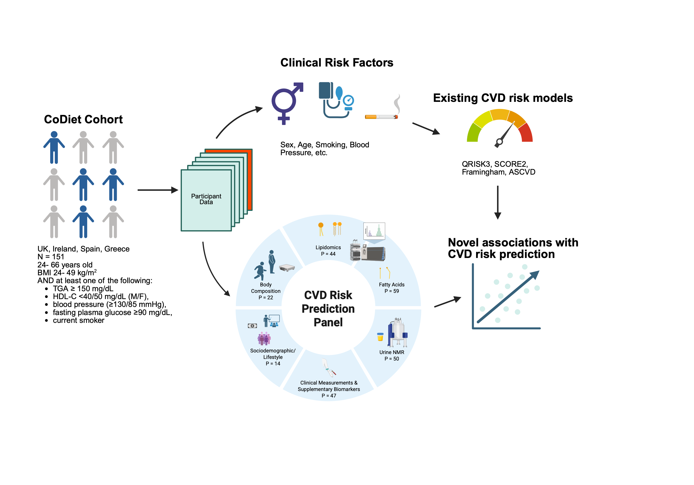

> This repository is a redacted public version of the original private research repository. Only the review-relevant code and non-sensitive files were retained, with commit history preserved for the retained subset.

# Multi-Domain Analysis of Predictors for Cardiovascular Risk Estimation in an Overweight and Obese Population
### An MRes Thesis Project (Biomedical Research – Data Science, Imperial College London)

## Abstract

Cardiovascular disease (CVD) remains the leading cause of mortality worldwide. Overweight and obesity are major and increasingly prevalent risk factors, yet established CVD risk scores do not adequately capture their risk and may underestimate CVD risk in this population. This work examines a multi-domain dataset comprising metabolomics (urinary metabolites, lipid profiles, fatty acids), clinical measurements, body composition metrics, and sociodemographic factors for their association with CVD risk and predictive utility, as assessed by four established 10-year CVD risk scores (ASCVD, Framingham, QRISK3, SCORE2). The overall study design is summarised in Figure 1.

  

Figure 1. Overview of the study design. Figure created with BioRender.com.
  
Participant-level data from the CoDiet cohort cannot be shared publicly. This repository contains all scripts used for the analyses and visualisations presented in this thesis.

## Analyses and Visualisation Scripts
### Cardiovascular Risk Score Calculation
- **QRISK3 Score**  
  Script: [`QRISK3_calculation.R`](H2_CardiovascularRisk/QRISK3_calculation.R)  
  *Note:* QRISK3 was calculated separately from the other risk scores, as it was the first score implemented in the project.

- **ASCVD, SCORE2, Framingham**  
  Script: [`Cardiovascular_RiskScore_Calculation.R`](H2_CardiovascularRisk/Cardiovascular_RiskScore_Calculation.R)

- **Figures**   
  All figures presented in Chapter 3.1 (*Cardiovascular Risk Scores*) were generated within [`Cardiovascular_RiskScore_Calculation.R`](H2_CardiovascularRisk/Cardiovascular_RiskScore_Calculation.R).
    
### Predictor Preparation
Preprocessing of predictor domains used for GLM analysis, machine learning comparison, and Elastic Net modelling was conducted in the following scripts:

- **Sociodemographic Predictors**  
  Preprocessing script: [`QRISK3_REDcap_random.R`](H2_CardiovascularRisk/QRISK3_REDcap_random.R)

- **Clinical Measurements and Supplementary Biomarkers (referred to as the “risk factor dataset” in the code)**  
    Preprocessing script: [`QRISK3_calculation.R`](H2_CardiovascularRisk/QRISK3_calculation.R)

- **Fatty Acids and Lipidomics Predictors**  
    Preprocessing script: [`QRISK3_lipidomics.R`](H2_CardiovascularRisk/QRISK3_lipidomics.R)

- **Urine NMR Predictors**  
    Preprocessing script: [`urine_nmr_data.R`](H2_CardiovascularRisk/urine_nmr_data.R)

- **Body Composition Predictors**  
    Preprocessing script: [`Body_composition_metrics.R`](H2_CardiovascularRisk/Body_composition_metrics.R)

### Generalised Linear Model (GLM) Analysis

Associations between predictors and CVD scores reported in Chapter 3.2 of the thesis were analysed using GLMs.
[`FixedEffectAssociations.R`](H2_CardiovascularRisk/FixedEffectAssociations.R) includes:
- Data preparation, model fitting, and output generation for the GLM analyses
- Figure generation for all figures presented in Chapter 3.2
- Generation of supplementary tables summarising covariate effects and full GLM results
- Model evaluation diagnostics and summary tables
  
The same analysis, additionally adjusting for age as a fixed effect, was conducted in: [`FixedEffectAge.R`](H2_CardiovascularRisk/FixedEffectAge.R).

### ML Model Comparison

The ML comparison used in the thesis is implemented in [`ML_comp_parameter_tuned.R`](H2_CardiovascularRisk/ML_comp_parameter_tuned.R).  
An earlier exploratory comparison using a hold-out subset of 20 participants (not included in the thesis) is implemented in: [`tidymodels_comparison.R`](H2_CardiovascularRisk/tidymodels_comparison.R).

### Elastic Net Regression Analysis
Elastic Net regression analysis and visualisation were implemented in [`ElaNet_Covariate_adj.R`](H2_CardiovascularRisk/ElaNet_Covariate_adj.R)

## Reproducibility

- R version: 4.5.1 
- Random seed: 42  
